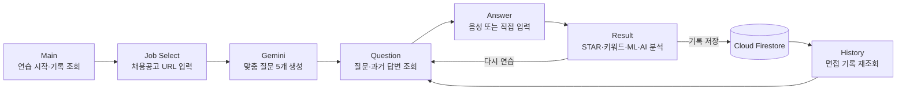

# AI Interview Trainer

> 채용공고 한 줄에서 시작해 질문 생성부터 음성 답변·AI 피드백·연습 기록까지 이어지는 Android 면접 코치


AI Interview Trainer는 채용공고의 실제 내용을 분석해 직무 맞춤 면접 질문을 만들고 사용자의 음성 답변을 텍스트로 변환한 뒤 답변 구조와 품질을 분석하는 Android 애플리케이션입니다. 하나의 면접 세션 안에서 질문별 답변을 여러 번 남기고 과거 결과를 다시 비교할 수 있습니다.

## 핵심 기능

- **채용공고 기반 질문 생성**: WebView로 공고 본문을 추출하고 Gemini가 질문 5개, 기대 키워드, 평가 포인트를 생성합니다.
- **음성·텍스트 답변**: Google Cloud Speech-to-Text로 음성을 변환하며 직접 입력도 지원합니다.
- **다층 답변 분석**: 답변 길이, 소요 시간, 키워드 포함률, 수치 표현, 구체성, STAR 구조를 분석합니다.
- **온디바이스 품질 예측**: 6개 특징값을 TensorFlow Lite 모델에 입력해 답변 품질 등급과 신뢰도를 예측합니다.
- **AI 종합 피드백**: 질문별 평가 기준과 분석 결과를 바탕으로 Gemini가 맞춤형 보완 의견을 제공합니다.
- **연습 기록 관리**: Cloud Firestore에 면접 세션·질문·복수 답변·분석 결과를 계층적으로 저장합니다.
- **개인화와 공유**: 면접별 면접관 이미지를 갤러리에서 선택하고 결과를 외부 앱으로 공유할 수 있습니다.

## 사용자 흐름



## 기술 스택

| 영역 | 기술 |
|---|---|
| Language / UI | Kotlin, Android XML, Material Components, ViewBinding |
| Async | Kotlin Coroutines, `lifecycleScope`, ExecutorService |
| AI | Gemini REST API, Google Cloud Speech-to-Text |
| Network | Retrofit, OkHttp, Gson, HttpURLConnection |
| ML | TensorFlow Lite(MLP) |
| Database | Firebase Cloud Firestore |
| Jetpack | RecyclerView, Activity Result API, Lifecycle |

## 프로젝트 구조

```text
app/src/main/
├── assets/
│   └── answer_quality_model.tflite
├── java/com/example/aiinterviewtrainer/
│   ├── analysis/       # 특징 추출과 STAR 분석
│   ├── contract/       # Activity 간 Intent 계약
│   ├── model/          # 질문·면접 데이터 모델
│   ├── network/        # Retrofit과 Gemini 요청/응답 모델
│   ├── repository/     # 질문 생성·종합 피드백 통신 계층
│   └── *Activity.kt    # 6개 화면과 사용자 흐름
└── res/
    ├── layout/         # Activity·RecyclerView 레이아웃
    └── drawable/       # 카드·상태·아이콘 리소스
```

## Firestore 구조

```text
History/{practiceId}
├── jobTitle
├── practiceDate
└── Questions/{questionId}
    ├── questionText
    ├── questionType
    ├── keywords
    ├── evaluationPoints
    └── Answers/{answerId}
        ├── userAnswer
        ├── answerLength / answerSeconds
        ├── includedKeywords / missingKeywords
        ├── STAR 분석 결과
        ├── TFLite 예측 결과
        ├── feedback
        └── createdAt
```

## 실행 준비

### 1. 요구 환경

- Android Studio
- JDK 11
- Android SDK 34
- Android 6.0(API 23) 이상 기기 또는 에뮬레이터
- Gemini API key
- Google Cloud Speech-to-Text API key
- Firebase 프로젝트와 Cloud Firestore

### 2. 프로젝트 받기

```bash
git clone https://github.com/jungchaejin/AIInterviewTrainer.git
cd AIInterviewTrainer
```

Android Studio에서 프로젝트를 열고 Gradle Sync를 실행합니다.

### 3. API 키 등록

프로젝트 루트의 `local.properties`에 아래 항목을 추가합니다.

```properties
gemini.api.key=YOUR_GEMINI_API_KEY
gemini.model.name=gemini-2.5-flash
google.stt.api.key=YOUR_GOOGLE_STT_API_KEY
```

### 4. Firebase 연결

1. Firebase Console에서 Android 앱 패키지 `com.example.aiinterviewtrainer`를 등록합니다.
2. Cloud Firestore를 활성화하고 개발·배포 환경에 맞는 보안 규칙을 설정합니다.
3. 발급된 `google-services.json`을 `app/` 폴더에 배치합니다.

### 5. 빌드

```powershell
.\gradlew.bat assembleDebug
```

## 주요 화면

| Activity | 역할 |
|---|---|
| `MainActivity` | 새 면접 연습과 기록 조회 진입점 |
| `JobSelectActivity` | 채용공고 추출, 질문 생성, 세션 저장 |
| `QuestionActivity` | 질문 5개와 질문별 답변 이력 표시 |
| `AnswerActivity` | 음성·텍스트 답변과 면접관 이미지 설정 |
| `ResultActivity` | 키워드·STAR·TFLite·Gemini 분석과 저장·공유 |
| `HistoryActivity` | 과거 면접 세션 조회 |
